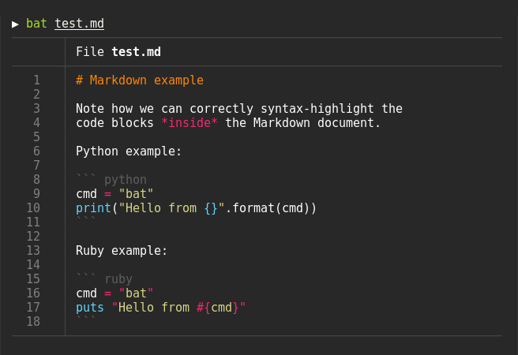

# Appcove Developer Software
This custom Debian PPA is used by AppCove to build and share all the in-house built power tools
--

## Installation

Install needed programs
``` bash
sudo apt install -y curl gpg
```

Download of the key and `source.list`
``` bash
curl -sLO https://appcove.github.io/developer-software/ubuntu/dists/jammy/main/binary-amd64/ads-release_1.0.1custom22.04_amd64.deb
sudo dpkg -i ads-release_1.0.1custom22.04_amd64.deb
sudo apt update
```
❗**Log out and log back in for systemwide changes to be applied**, then try to install one of our tools: `sudo apt install git-excess`


Install everything: 
```
sudo apt install ads-everything
```
### List of available Packages after installation

``` bash
sudo apt list "ads-*"
```
Should output
- ads-release - This package installs the needed files for the PPA to work correctly
- [ads-git-excess](https://github.com/appcove/git-excess)
- [ads-pastel](https://github.com/sharkdp/pastel)
- [ads-fd](https://github.com/sharkdp/fd)
- [ads-bat](https://github.com/sharkdp/bat)
- [ads-procs](https://github.com/dalance/procs) - Replacement for `ps` written in Rust.
- [ads-grex](https://github.com/pemistahl/grex) - An intuitive regex generator meant to create expression based on user's input.
- [ads-broot](https://github.com/Canop/broot) - Navigate directories and list content in a tree, with a lot of additional features.
- [ads-exa](https://github.com/ogham/exa) - Modern replacement for the venerable file-listing command-line program `ls`.
- [ads-sd](https://github.com/chmln/sd) - An intuitive find & replace CLI.
- [ads-dust](https://github.com/bootandy/dust) - Dust is a more intuitive version of `du`, used for displaying disk usage statistics.
- [ads-ripgrep](https://github.com/BurntSushi/ripgrep) - ripgrep is a line-oriented search tool that recursively searches the current directory for a regex pattern.
- [ads-bottom](https://github.com/ClementTsang/bottom) - A customizable cross-platform graphical process/system monitor for the terminal.
- [ads-jaq](https://github.com/01mf02/jaq) - A jq clone focussed on correctness, speed, and simplicity
- [ads-et](https://github.com/solidiquis/erdtree) - A modern, vibrant, and multi-threaded file-tree visualizer and disk usage analyzer
- [ads-delta](https://github.com/dandavison/delta) - Modern CLI git diff analizer (requires manual setup LOOK BELOW)

# Examples 
<details><summary>fd</summary>


</details>

<details><summary>bat</summary>



``` bash 
bat src/*.rs # show multiple files at once
bat header.md content.md footer.md > document.md
bat -n main.rs  # show line numbers (only)

```

</details>

<details><summary>procs</summary>


``` bash 
procs # list all processes
procs <executable>  # `procs chrome` list all processes of application
procs --tree
```
[Other examples of procs](https://github.com/dalance/procs#usage)

</details>


<details><summary>broot</summary>

[broot examples](https://github.com/Canop/broot#get-an-overview-of-a-directory-even-a-big-one)

</details>

<details><summary>sd</summary>

- Simpler syntax for replacing all occurrences:
  - sd: `sd before after`
  - sed: `sed s/before/after/g`
- Replace newlines with commas:
  - sd: `sd '\n' ','`
  - sed: `sed ':a;N;$!ba;s/\n/,/g'`
- Extracting stuff out of strings containing slashes:
  - sd: `echo "sample with /path/" | sd '.*(/.*/)' '$1'`
  - sed: use different delimiters every time depending on expression so that the command is not completely unreadable
    - `echo "sample with /path/" | sed -E 's/.*(\\/.*\\/)/\1/g'`
    - `echo "sample with /path/" | sed -E 's|.*(/.*/)|\1|g'`
- In place modification of files:
  - sd: `sd before after file.txt`
  - sd:: you need to remember to use `-e` or else some platforms will consider the next argument to be a backup suffix
    - `sed -i -e 's/before/after/g' file.txt`
</details>

<details><summary>dust</summary>


``` shell 
Usage: dust
Usage: dust <dir>
Usage: dust <dir>  <another_dir> <and_more>
Usage: dust -p (full-path - Show fullpath of the subdirectories)
Usage: dust -s (apparent-size - shows the length of the file as opposed to the amount of disk space it uses)
Usage: dust -n 30  (Shows 30 directories instead of the default [default is terminal height])
Usage: dust -d 3  (Shows 3 levels of subdirectories)
Usage: dust -D (Show only directories (eg dust -D))
Usage: dust -r (reverse order of output)
Usage: dust -H (si print sizes in powers of 1000 instead of 1024)
Usage: dust -X ignore  (ignore all files and directories with the name 'ignore')
Usage: dust -x (Only show directories on the same filesystem)
Usage: dust -b (Do not show percentages or draw ASCII bars)
Usage: dust -i (Do not show hidden files)
Usage: dust -c (No colors [monochrome])
Usage: dust -f (Count files instead of diskspace)
Usage: dust -t (Group by filetype)
Usage: dust -z 10M (min-size, Only include files larger than 10M)
Usage: dust -e regex (Only include files matching this regex (eg dust -e "\.png$" would match png files))
Usage: dust -v regex (Exclude files matching this regex (eg dust -v "\.png$" would ignore png files))
```

</details>


<details><summary>delta</summary>
Install it and then add this to your `~/.gitconfig`:

```gitconfig
[core]
    pager = delta

[interactive]
    diffFilter = delta --color-only

[delta]
    navigate = true    # use n and N to move between diff sections
    light = false      # set to true if you're in a terminal w/ a light background color (e.g. the default macOS terminal)

[merge]
    conflictstyle = diff3

[diff]
    colorMoved = default
```

</details>
   
   


